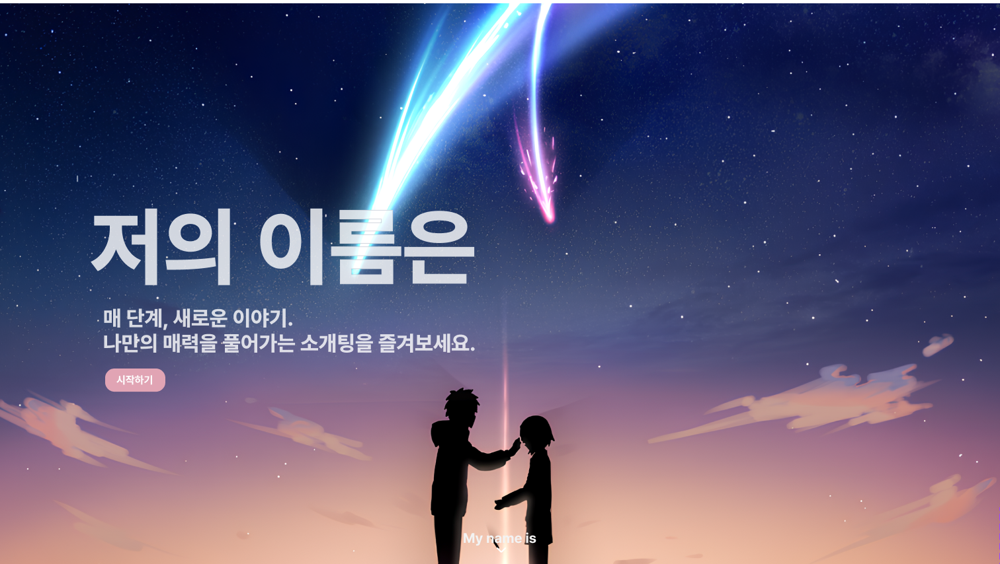
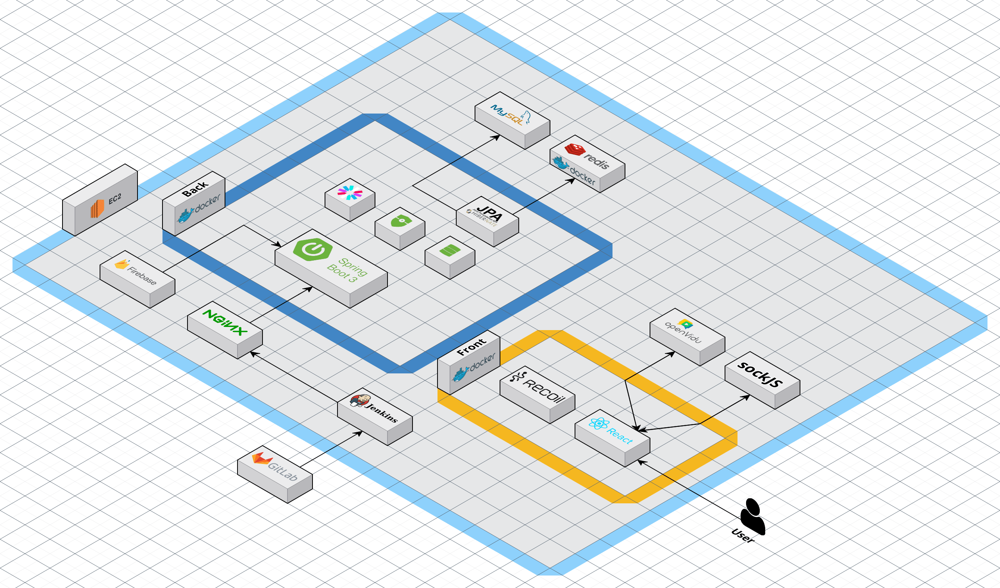
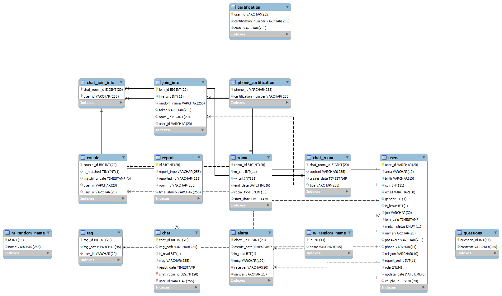

# 💝 저의 이름은 (매 단계, 새로운 이야기. 나만의 매력을 풀어가는 소개팅 서비스)

-   SSAFY 10기 2학기 공통프로젝트

-   프로젝트 기간: 2024/01/03 ~ 2024/02/16

-   서비스 바로 가기:

## 💌 프로젝트 소개

> 매 단계, 새로운 이야기. 나만의 매력을 풀어가는 소개팅 서비스

1️⃣ 랜덤 매칭 알고리즘

2️⃣ 다대다 단계별 소개팅

3️⃣ 실시간 채팅

4️⃣ 알람 (투표 등)

5️⃣ 신고 기능 (텍스트, 영상)

## 💌 기능 소개

### - 다대다 소개팅

-   성별, 원하는 매칭 인원(2:2, 3:3, 4:4)을 선택 후, 해당 기준에 맞는 인원이 모이면 **매칭 알고리즘에 의해 자동으로 방 생성**
-   **단계마다 정보가 공개**되는 단계별 소개팅 서비스
    -   **총 5단계로, 1~3단계는 얼굴 미공개, 4~5단계는 얼굴 공개**
    -   1단계: 나이, 지역 공개
    -   2단계: 관심사, MBTI 등 나를 표현하는 키워드 공개 (이후 투표)
    -   3단계: 직업 공개 (이후 투표)
    -   4단계: 얼굴 공개
    -   5단계: 커플 밸런스 게임 진행 (이후 최종 투표)
-   호감이 가는 참여자에게 **투표할 수 있는 기능** 제공
-   **단, 최종 커플 성사시 다대다 소개팅 서비스 사용 불가**

### - 커플 서비스

-   성사된 커플만이 이용할 수 있는 서비스 제공
-   **1:1 실시간 채팅**
-   **1:1 화상 채팅**

### - 회원 관리

-   1인 1회원 정책을 위한 회원가입시 휴대폰 인증 절차 필요
-   소개팅 도중 악의적인 행동을 하는 경우 신고 접수 기능 제공
    -   신고 접수 시 피신고자의 녹화된 영상 STT(Speech To Text) 처리 후, LSP & KMP 알고리즘을 적용하여 음성에 대한 신고 조치
    -   신고 조치에 의해 피신고자는 신고 점수 증가
    -   특정 신고 점수를 초과한 경우 '저의 이름은' 서비스 이용 불가

## 💌 서비스 화면

추가 예정

## 📚 기술 스택

### FrontEnd

-   Visual Studio Code
-   React
-   TypeScript
-   Recoil
-   styled-components
-   react-router-dom
-   axios
-   SockJS & Stomp
-   NodeJS 20.11.0 LTS

### BackEnd

-   IntelliJ
-   Java
-   Spring Boot
-   Spring Boot JPA
-   Spring Security
-   Redis
-   MySQL

### CI/CD

-   AWS EC2
-   Docker
-   Jenkins

### 협업 툴

-   GitLab
-   Jira
-   Notion

## 📚 산출물

### 서비스 아키텍처

### ERD

### 와이어프레임

https://www.figma.com/file/1OqBxZwYWltMVX4cB3l5cj/%EC%A0%80%EC%9D%98-%EC%9D%B4%EB%A6%84%EC%9D%80?type=design&node-id=85-5637&mode=design&t=ztuFcIEq1MBYEp43-0

### API 명세

https://www.notion.so/6caf527bfe494a959333b7ce65dce59b?pvs=4

## 📚 포팅 매뉴얼

[포팅 매뉴얼 바로 가기](./exec/포팅매뉴얼.md)

## 👨‍👨‍👧‍👦 팀원 및 역할

| 구분 | 이름   | 역할            |
| ---- | ------ | --------------- |
| 팀장 | 김아현 | FrontEnd, Infra |
| 팀원 | 박태호 | BackEnd, Infra  |
| 팀원 | 박이완 | BackEnd         |
| 팀원 | 승재홍 | FrontEnd        |
| 팀원 | 조은서 | FrontEnd        |

## 👨‍👨‍👧‍👦 팀 노션

https://www.notion.so/dhflxhdxhd/81ab9feb28bc4b008563be8023f55151
